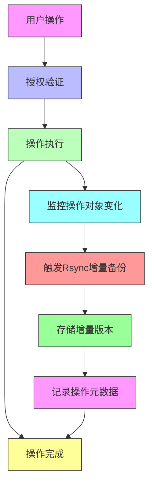

# OpenClaw 备份方案分析与改进方案

## 🎯 项目概述

OpenClaw 备份方案分析项目是一个专注于优化 OpenClaw 现有备份功能的技术研究项目。该项目通过深入分析传统备份方案的局限性，提出了基于 Rsync 技术的改进方案，旨在提供更高效、更可靠的备份解决方案。

## 📋 项目结构

```
openclaw-plugins-backup/
├── 备份方案分析.md          # 核心技术分析文档
├── README.md               # 项目说明文档
├── LICENSE                 # MIT许可证
├── CONTRIBUTING.md         # 贡献指南
├── .gitignore              # git忽略配置文件
├── .github/                # GitHub工作流配置
└── docs/                   # 文档目录
```

## 🚀 核心功能

### 现有问题分析
- ✅ 缺乏增量备份功能
- ✅ 每次完整备份耗时过长
- ✅ 存储利用率低下
- ✅ 网络中断导致备份失败
- ✅ 恢复过程复杂
- ✅ 备份状态无法及时通知

### 改进方案优势
- 🚀 **增量同步**：减少 70-90% 传输量
- 📦 **存储优化**：提升 50-80% 存储利用率
- 🌐 **网络容错**：断点续传机制
- ⚡ **恢复速度**：减少 60-80% 恢复时间
- 🎯 **数据完整性**：校验和验证机制
- 💰 **成本节约**：长期成本减少 60-70%

## 📊 技术方案

### Rsync 技术优势

| 特性       | 传统方案 | Rsync方案 | 改进效果           | 应用场景       |
| -------- | ---- | ------- | -------------- | ---------- |
| **传输效率** | 完整传输 | 增量同步    | 减少 70-90% 传输量  | 大规模文件、网络受限 |
| **存储效率** | 重复存储 | 增量存储    | 存储利用率提升 50-80% | 定期备份、长期保存  |
| **网络容错** | 中断重传 | 断点续传    | 网络恢复后继续传输      | 不稳定网络环境    |
| **恢复速度** | 完整恢复 | 增量恢复    | 恢复时间减少 60-80%  | 紧急恢复场景     |
| **增量备份** | 不支持  | 差异传输    | 支持增量更新         | 每日备份、实时同步  |
| **压缩传输** | 无    | 传输压缩    | 网络传输减少 30-60%  | 低带宽环境      |
| **校验机制** | 简单校验 | 校验和验证   | 数据完整性保障        | 重要数据备份     |

## 📈 成本效益分析

### 直接成本节约

| 成本类别 | 传统方案 | Rsync方案 | 节约比例 |
|---------|---------|---------|---------|
| **网络带宽** | 完整传输 | 增量同步 | 60-80% |
| **存储费用** | 重复存储 | 增量存储 | 50-80% |
| **备份设备** | 高频读写磁盘 | 标准存储设备 | 30-50% |
| **恢复成本** | 完整恢复 | 增量恢复 | 50-70% |

## 🔧 技术架构

### 系统架构



## 📋 实施计划

### 阶段一：基础功能实现 (1-2个月)
- ✅ 核心同步引擎开发
- ✅ 增量存储管理
- ✅ 无感知备份触发机制

### 阶段二：优化和测试 (2-3个月)
- ⚙️ 性能优化
- ⚙️ 兼容性测试
- ⚙️ 回滚功能实现

### 阶段三：高级功能开发 (3-4个月)
- 🔄 断点续传
- 📦 传输压缩
- 🎨 用户界面优化

### 阶段四：生产部署 (4-5个月)
- 📱 多平台适配
- 📦 插件封装
- 🚀 生产环境测试

## 📞 联系方式

如有问题或建议，请通过以下方式联系：

- 项目仓库：https://github.com/ai-toolbox-hub/openclaw-plugins-backup
- 提交Issue：https://github.com/ai-toolbox-hub/openclaw-plugins-backup/issues

## 📄 许可证

本项目采用 MIT 许可证 - 查看 LICENSE 文件了解详情。
