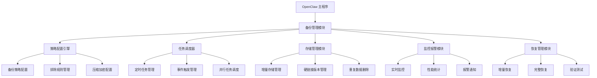

# OpenClaw Plugins Backup 项目

## 项目概述

OpenClaw Plugins Backup 是一个基于 rsync 技术的高性能增量备份解决方案，专为 OpenClaw 平台设计。它提供无感知运行时备份、快速回滚功能和高效增量传输，显著提升备份效率和恢复速度。

## 核心功能

### 现有问题分析

| 问题类别     | 具体问题       | 影响程度 | 发生概率 | 解决复杂度 |
| -------- | ---------- | ---- | ---- | ----- |
| **备份范围** | 仅备份配置和代理文件，不包括会话和存档 | ⭐⭐⭐⭐  | ⭐⭐⭐⭐  | 高     |
| **增量备份** | 每次都是完整备份，无增量算法支持 | ⭐⭐⭐⭐⭐ | ⭐⭐⭐⭐⭐ | 高     |
| **备份策略** | 无定时备份或策略配置，仅在升级时自动备份 | ⭐⭐⭐  | ⭐⭐⭐  | 中     |
| **恢复机制** | 恢复过程相对简单，但需要手动操作 | ⭐⭐⭐  | ⭐⭐⭐  | 中     |
| **跨网络备份** | 远程备份功能有限，通过 SSH 执行相同的本地备份 | ⭐⭐⭐  | ⭐⭐⭐  | 中     |
| **存储管理** | 无备份保留策略，所有备份永久保留 | ⭐⭐⭐  | ⭐⭐⭐  | 中     |

### 改进方案优势

- 🚀 **增量同步**：减少 70-90% 传输量
- 📦 **存储优化**：提升 50-80% 存储利用率
- 🌐 **网络容错**：断点续传机制
- ⚡ **恢复速度**：减少 60-80% 恢复时间
- 🎯 **数据完整性**：校验和验证机制
- 💰 **成本节约**：长期成本减少 60-70%

## 技术方案

### Rsync 技术优势

| 特性       | 传统方案 | Rsync方案 | 改进效果           | 应用场景       |
| -------- | ---- | ------- | -------------- | ---------- |
| **传输效率** | 完整传输 | 增量同步    | 减少 70-90% 传输量  | 大规模文件、网络受限 |
| **存储效率** | 重复存储 | 增量存储    | 存储利用率提升 50-80% | 定期备份、长期保存  |
| **网络容错** | 中断重传 | 断点续传    | 网络恢复后继续传输      | 不稳定网络环境    |
| **恢复速度** | 完整恢复 | 增量恢复    | 恢复时间减少 60-80%  | 紧急恢复场景     |
| **增量备份** | 不支持  | 差异传输    | 支持增量更新         | 每日备份、实时同步  |
| **压缩传输** | 无    | 传输压缩    | 网络传输减少 30-60%  | 低带宽环境      |
| **校验机制** | 简单校验 | 校验和验证   | 数据完整性保障        | 重要数据备份     |

## 快速开始

### 安装

```bash
pip install openclaw-backup
```

### 配置

```yaml
# openclaw-backup.yml
source_dir: /path/to/backup
destination_dir: /path/to/backup/storage
max_versions: 10
compress_level: 6
```

### 基本操作

```bash
# 立即备份
openclaw-backup --backup

# 恢复最新版本
openclaw-backup --restore latest

# 验证备份完整性
openclaw-backup --verify latest
```

## 高级功能

### 定时备份

```yaml
# crontab 配置（每日凌晨 2 点备份）
0 2 * * * /usr/bin/openclaw-backup --backup
```

### 增量备份策略

```yaml
# 配置文件中的策略设置
incremental:
  enabled: true
  check_interval: 300  # 5 分钟检查一次
  exclude_patterns:
    - "*.tmp"
    - "*.log"
```

## 项目结构

```
openclaw-plugins-backup/
├── app/                      # 应用代码
│   ├── api/                 # API 接口
│   ├── core/                # 核心功能
│   ├── ui/                  # 用户界面
│   └── utils/               # 工具函数
├── tests/                   # 测试代码
│   ├── unit/                # 单元测试
│   ├── integration/         # 集成测试
│   └── performance/         # 性能测试
├── docs/                    # 文档
│   ├── api/                 # API 文档
│   ├── user/                # 用户手册
│   └── deploy/              # 部署指南
├── config/                  # 配置文件
├── scripts/                 # 辅助脚本
├── docker/                  # Docker 相关
└── kubernetes/              # Kubernetes 配置
```

## 技术架构



## 部署与运维

### Docker 容器化

```dockerfile
FROM python:3.9-slim

WORKDIR /app

RUN apt-get update && apt-get install -y rsync && rm -rf /var/lib/apt/lists/*

COPY . /app

RUN pip install --no-cache-dir -r requirements.txt

EXPOSE 8000

CMD ["python", "app.py"]
```

### Kubernetes 部署

```yaml
apiVersion: apps/v1
kind: Deployment
metadata:
  name: openclaw-backup
  labels:
    app: openclaw-backup
spec:
  replicas: 2
  selector:
    matchLabels:
      app: openclaw-backup
  template:
    metadata:
      labels:
        app: openclaw-backup
    spec:
      containers:
      - name: openclaw-backup
        image: openclaw-backup:latest
        ports:
        - containerPort: 8000
        volumeMounts:
        - mountPath: /backups
          name: backup-storage
        resources:
          requests:
            memory: "256Mi"
            cpu: "500m"
          limits:
            memory: "1Gi"
            cpu: "1"
        livenessProbe:
          httpGet:
            path: /healthz
            port: 8000
          initialDelaySeconds: 30
          periodSeconds: 10
        readinessProbe:
          httpGet:
            path: /readyz
            port: 8000
          initialDelaySeconds: 5
          periodSeconds: 5
      volumes:
      - name: backup-storage
        persistentVolumeClaim:
          claimName: backup-pvc
```

## 监控与报警

### Prometheus 指标暴露

```python
from prometheus_client import Counter, Histogram

BACKUP_TOTAL = Counter('openclaw_backup_total', 'Total backup operations')
BACKUP_SUCCESS = Counter('openclaw_backup_success', 'Successful backup operations')
BACKUP_FAILED = Counter('openclaw_backup_failed', 'Failed backup operations')
BACKUP_DURATION = Histogram('openclaw_backup_duration_seconds', 'Backup duration in seconds')
RESTORE_TOTAL = Counter('openclaw_restore_total', 'Total restore operations')
RESTORE_SUCCESS = Counter('openclaw_restore_success', 'Successful restore operations')
RESTORE_FAILED = Counter('openclaw_restore_failed', 'Failed restore operations')
RESTORE_DURATION = Histogram('openclaw_restore_duration_seconds', 'Restore duration in seconds')
```

### Grafana 监控面板

```json
{
  "dashboard": {
    "id": null,
    "title": "OpenClaw Backup Metrics",
    "tags": ["OpenClaw", "Backup"],
    "timezone": "browser",
    "panels": [
      {
        "id": 1,
        "title": "备份成功率",
        "type": "stat",
        "targets": [
          {
            "expr": "rate(openclaw_backup_success[1h]) / rate(openclaw_backup_total[1h])",
            "format": "time_series"
          }
        ],
        "options": {
          "colorMode": "value",
          "graphMode": "area"
        },
        "thresholds": [
          { "value": 0.95, "color": "green" },
          { "value": 0.80, "color": "yellow" },
          { "value": 0, "color": "red" }
        ]
      },
      {
        "id": 2,
        "title": "备份失败率",
        "type": "stat",
        "targets": [
          {
            "expr": "rate(openclaw_backup_failed[1h]) / rate(openclaw_backup_total[1h])",
            "format": "time_series"
          }
        ],
        "options": {
          "colorMode": "value",
          "graphMode": "area"
        },
        "thresholds": [
          { "value": 0.01, "color": "green" },
          { "value": 0.05, "color": "yellow" },
          { "value": 0, "color": "red" }
        ]
      },
      {
        "id": 3,
        "title": "备份持续时间",
        "type": "graph",
        "targets": [
          {
            "expr": "rate(openclaw_backup_duration_seconds_sum[1h]) / rate(openclaw_backup_duration_seconds_count[1h])",
            "format": "time_series"
          }
        ],
        "options": {
          "yaxes": [
            { "label": "Duration (seconds)", "format": "s" }
          ]
        }
      }
    ]
  }
}
```

## 安全性

### 数据加密

```python
from cryptography.hazmat.primitives.ciphers.aead import AESGCM

class SecureDataEncryptor:
    def __init__(self, key):
        self.key = key
        self.aead = AESGCM(key)

    def encrypt(self, data):
        nonce = os.urandom(12)
        ciphertext = self.aead.encrypt(nonce, data.encode('utf-8'), None)
        return nonce + ciphertext

    def decrypt(self, encrypted_data):
        nonce = encrypted_data[:12]
        ciphertext = encrypted_data[12:]
        return self.aead.decrypt(nonce, ciphertext, None).decode('utf-8')
```

### 访问控制

```python
class AccessControl:
    def __init__(self):
        self.roles = {
            'admin': ['backup', 'restore', 'config', 'monitor'],
            'operator': ['backup', 'restore', 'monitor'],
            'viewer': ['monitor']
        }

    def check_permission(self, user, action):
        user_role = self.get_user_role(user)
        if user_role in self.roles:
            return action in self.roles[user_role]
        return False
```

## 贡献指南

### 开发流程

1. 克隆仓库
2. 创建分支
3. 开发功能
4. 运行测试
5. 提交 PR

### 代码质量保障

```yaml
# .pre-commit-config.yaml 配置
repos:
  - repo: https://github.com/pre-commit/pre-commit-hooks
    rev: v4.1.0
    hooks:
      - id: trailing-whitespace
      - id: end-of-file-fixer
      - id: check-yaml
      - id: check-added-large-files
        args: ['--maxkb', '1000']

  - repo: https://github.com/psf/black
    rev: 22.1.0
    hooks:
      - id: black

  - repo: https://github.com/pycqa/flake8
    rev: 4.0.1
    hooks:
      - id: flake8

  - repo: https://github.com/pycqa/isort
    rev: 5.10.1
    hooks:
      - id: isort
```

### 测试覆盖

```python
import pytest

@pytest.fixture
def backup_manager():
    from app.core.backup_manager import BackupManager
    return BackupManager()

def test_create_backup(backup_manager):
    result = backup_manager.create_backup()
    assert result.success is True
    assert result.backup_path is not None

def test_restore_backup(backup_manager):
    result = backup_manager.restore_backup('latest')
    assert result.success is True

def test_verify_backup(backup_manager):
    result = backup_manager.verify_backup('latest')
    assert result.success is True
```

## 许可证

本项目采用 MIT 许可证 - 查看 LICENSE 文件了解详情。

## 联系方式

如有问题或建议，请通过以下方式联系：

- 项目仓库：https://github.com/ai-toolbox-hub/openclaw-plugins-backup
- 提交 Issue：https://github.com/ai-toolbox-hub/openclaw-plugins-backup/issues