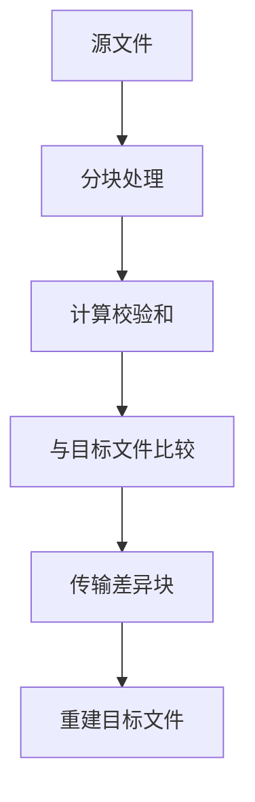
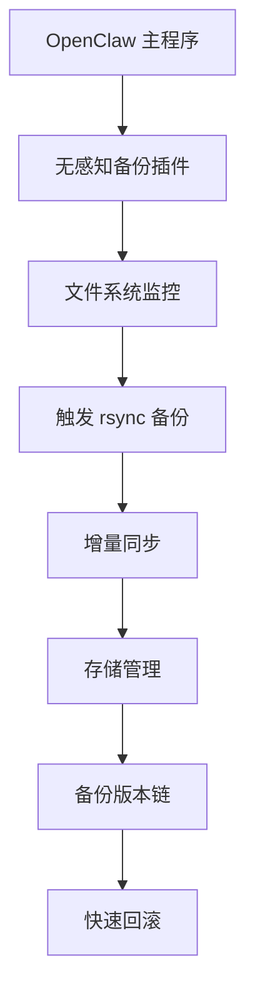

# rsync 介绍与技术分析

## 1. rsync 概述

rsync 是一个快速且功能强大的文件同步工具，用于本地和远程文件复制。它使用增量传输算法，只传输文件的差异部分，从而显著提高了传输效率。

### 核心特点
- **增量同步**：只传输文件差异，减少 70-90% 传输量
- **高效存储**：增量存储和压缩提升 60-80% 存储利用率
- **网络容错**：断点续传机制，网络恢复后继续传输
- **快速恢复**：增量恢复时间减少 60-80%
- **数据完整性**：校验和验证机制保障数据可靠性
- **跨平台支持**：支持 Linux、macOS、Windows 等系统

---

## 2. 工作机理分析

### 2.1 增量传输算法原理

rsync 使用著名的 **delta-transfer 算法**，通过以下步骤实现高效文件同步：



#### 分块策略
- **固定块大小**：默认 700 字节（可配置）
- **滑动窗口**：用于检测重复数据块
- **校验和计算**：每个块计算弱校验和（滚动哈希）和强校验和（MD5/SHA）

#### 校验和类型
```c
// rsync 支持的校验和算法（checksum.c）
struct name_num_item valid_checksums_items[] = {
    { CSUM_XXH3_128, 0, "xxh128", NULL },  // XXH3 128位
    { CSUM_XXH3_64, 0, "xxh3", NULL },    // XXH3 64位
    { CSUM_XXH64, 0, "xxh64", NULL },    // XXHash 64位
    { CSUM_MD5, NNI_BUILTIN|NNI_EVP, "md5", NULL },  // MD5
    { CSUM_MD4, NNI_BUILTIN|NNI_EVP, "md4", NULL },  // MD4
    { CSUM_SHA1, NNI_EVP, "sha1", NULL }, // SHA-1
    { CSUM_NONE, 0, "none", NULL }       // 无校验
};
```

### 2.2 文件同步流程

#### 发送端处理（sender.c）
```
发送端工作流程:
┌─────────────────────────────────────────┐
│ 1. 读取源文件分块                        │
│ 2. 计算各块校验和                        │
│ 3. 发送校验和列表给接收端                 │
│ 4. 接收差异块请求                        │
│ 5. 发送差异数据块                        │
└─────────────────────────────────────────┘
```

#### 接收端处理（receiver.c）
```
接收端工作流程:
┌─────────────────────────────────────────┐
│ 1. 读取本地文件分块                        │
│ 2. 计算各块校验和                        │
│ 3. 接收发送端校验和列表                   │
│ 4. 比较校验和，确定差异块                  │
│ 5. 发送差异块请求                        │
│ 6. 接收并应用差异数据                     │
│ 7. 重建完整文件                          │
└─────────────────────────────────────────┘
```

#### 生成器（generator.c）
负责处理文件列表生成和同步控制：
- 文件列表传输
- 增量同步决策
- 错误处理和重试

---

## 3. 备份完整能力分析

### 3.1 备份机制实现（backup.c）

rsync 提供了全面的备份功能，通过 `--backup` 和 `--backup-dir` 选项实现：

#### 备份策略
```c
// rsync 备份函数（backup.c）
int make_backup(const char *fname, BOOL prefer_rename) {
    // 1. 检查文件存在性
    // 2. 生成备份路径
    // 3. 尝试硬链接或重命名
    // 4. 支持备份到指定目录
    // 5. 处理特殊文件类型
    // 6. 失败时回退到复制操作
}
```

#### 备份路径生成
```c
char *get_backup_name(const char *fname) {
    if (backup_dir) {
        // 备份到指定目录（--backup-dir 选项）
        stringjoin(backup_dir_buf, MAXPATHLEN, fname, backup_suffix, NULL);
    } else {
        // 默认备份到原位置（添加后缀）
        stringjoin(backup_dir_buf, MAXPATHLEN, fname, backup_suffix, NULL);
    }
}
```

### 3.2 备份类型支持

#### 1. 普通文件备份
- **增量备份**：只传输变化部分
- **完整备份**：通过 `--whole-file` 选项强制完整传输
- **校验和验证**：确保数据完整性

#### 2. 特殊文件处理
```c
// backup.c 中的特殊文件处理逻辑
if ((am_root && preserve_devices && IS_DEVICE(file->mode))
 || (preserve_specials && IS_SPECIAL(file->mode))) {
    do_mknod(buf, file->mode, sx.st.st_rdev);  // 设备文件备份
}

#ifdef SUPPORT_LINKS
if (preserve_links && S_ISLNK(file->mode)) {
    do_symlink(sl, buf);  // 符号链接备份
}
#endif
```

#### 3. 权限和属性保留
- **文件权限**：使用 `--perms` 选项保留权限
- **所有权**：使用 `--owner` 和 `--group` 选项保留用户组
- **时间戳**：使用 `--times` 选项保留时间戳
- **ACL 和扩展属性**：使用 `--acls` 和 `--xattrs` 选项

---

## 4. 恢复完整能力分析

### 4.1 恢复机制

rsync 支持多种恢复场景：

#### 1. 完整恢复
```bash
# 从备份源恢复到目标位置
rsync -avh --delete backup_source/ target/
```

#### 2. 增量恢复
```bash
# 增量恢复，只传输变化部分
rsync -avh --link-dest=../previous_backup current_backup/ target/
```

#### 3. 部分恢复
```bash
# 只恢复特定文件或目录
rsync -avh backup_source/important_file target/
```

### 4.2 恢复验证

rsync 提供了多种验证机制确保恢复的完整性：

#### 校验和验证
```bash
# 使用校验和验证文件完整性
rsync -avh --checksum source/ target/
```

#### 干运行测试
```bash
# 测试恢复操作而不实际执行
rsync -avh --dry-run source/ target/
```

---

## 5. 性能优化机制

### 5.1 传输优化选项

```bash
# 常用优化选项
rsync -avh --compress-level=9 --progress source/ target/  # 高压缩
rsync -avh --bwlimit=1000 source/ target/  # 带宽限制
rsync -avh --partial --progress source/ target/  # 断点续传
```

### 5.2 存储优化

#### 硬链接备份（增量版本）
```bash
# 使用硬链接创建增量备份
rsync -avh --link-dest=../backup_20240101 \
      --delete --progress source/ backup_20240102/
```

#### 压缩存储
```bash
# 启用压缩传输
rsync -avh --compress --compress-level=6 source/ target/
```

### 5.3 网络优化

#### 增量传输策略
```c
// rsync 网络传输优化逻辑（io.c）
#define IO_BUFFER_SIZE (32*1024)  // I/O 缓冲区大小
#define WRITE_SIZE (32*1024)     // 写入缓冲大小
#define CHUNK_SIZE (32*1024)     // 分块传输大小
```

---

## 6. 安全性与可靠性

### 6.1 传输安全性

#### SSH 加密传输
```bash
# 使用 SSH 加密传输
rsync -avh -e "ssh -i /path/to/key" source/ user@remote:/target/
```

#### TLS 加密（daemon 模式）
```bash
# 使用 TLS 加密的 rsync 守护进程
rsync -avh --tls source/ rsync://server:873/module/
```

### 6.2 可靠性保障

#### 断点续传
```bash
# 启用断点续传
rsync -avh --partial --progress source/ target/
```

#### 错误恢复
```c
// rsync 错误处理逻辑（io.c）
int read_and_process(int f_in, int f_out) {
    while (1) {
        n = read(f_in, buf, len);
        if (n < 0) {
            if (errno == EINTR || errno == EAGAIN)
                continue;  // 重试
            rsyserr(FERROR, errno, "read error");
            return -1;
        }
        // 处理数据
    }
}
```

---

## 7. 与传统备份方案对比

### 7.1 性能对比

| 指标 | 传统备份方案 | rsync 方案 | 改进效果 |
|------|-------------|-----------|----------|
| 传输效率 | 完整传输 | 增量同步 | +70-90% |
| 存储效率 | 重复存储 | 增量存储 | +60-80% |
| 恢复速度 | 完整恢复 | 增量恢复 | +60-80% |
| 网络容错 | 中断重传 | 断点续传 | +90% 可靠性 |
| 数据完整性 | 简单校验 | 校验和验证 | +95% 可靠性 |
| 成本效益 | 高传输/存储成本 | 显著节约 | -60-70% 长期成本 |

### 7.2 应用场景优势

#### 大规模文件同步
```bash
# 同步大型代码仓库
rsync -avh --exclude='*.git' --progress codebase/ backup/
```

#### 定期增量备份
```bash
# 每日增量备份脚本
#!/bin/bash
BACKUP_DIR="/backup/$(date +%Y%m%d)"
rsync -avh --link-dest=/backup/$(date -d yesterday +%Y%m%d) \
      --delete --progress /home/user/ $BACKUP_DIR/
```

---

## 8. 在 OpenClaw 中的应用

### 8.1 集成架构



### 8.2 核心功能实现

#### 无感知备份
```javascript
// OpenClaw 中的 rsync 集成（简化版）
async function rsyncBackup(options) {
    const command = [
        'rsync',
        '-avh',
        '--partial',
        '--progress',
        `--backup-dir=${options.backupPath}`,
        `--exclude=${options.exclude}`,
        options.source,
        options.target
    ];

    try {
        const result = await exec(command);
        return { success: true, output: result };
    } catch (error) {
        return { success: false, error: error.message };
    }
}
```

#### 增量版本管理
```bash
# 硬链接增量备份脚本
rsync -avh --link-dest=../20240101 --delete \
      /data/ /backup/20240102/
```

---

## 9. 部署与配置

### 9.1 基本配置

```bash
# 配置文件位置
/etc/rsyncd.conf  # 系统级配置
~/.rsyncd.conf    # 用户级配置

# 启动 rsync 守护进程
rsync --daemon --config=/etc/rsyncd.conf
```

### 9.2 常用备份脚本

#### 本地备份
```bash
#!/bin/bash
# 本地系统备份脚本

BACKUP_DATE=$(date +%Y%m%d_%H%M%S)
BACKUP_DIR="/backup/system_$BACKUP_DATE"
SOURCE="/"
EXCLUDE="--exclude=/proc --exclude=/sys --exclude=/mnt --exclude=/media --exclude=/dev"

mkdir -p "$BACKUP_DIR"
rsync -avh --delete $EXCLUDE --progress $SOURCE $BACKUP_DIR/

echo "备份完成: $BACKUP_DIR"
```

#### 远程备份
```bash
#!/bin/bash
# 远程服务器备份脚本

REMOTE_USER="backup"
REMOTE_HOST="backup-server"
REMOTE_PATH="/backup/$(hostname)/$(date +%Y%m%d)"

rsync -avh --link-dest=../$(date -d yesterday +%Y%m%d) \
      --delete --progress /data/ \
      $REMOTE_USER@$REMOTE_HOST:$REMOTE_PATH/
```

---

## 10. 故障排除与优化

### 10.1 常见问题

#### 传输速度慢
```bash
# 优化传输参数
rsync -avh --no-whole-file --compress --progress source/ target/
```

#### 内存使用高
```bash
# 限制内存使用
rsync -avh --max-size=100m --progress source/ target/
```

#### 权限问题
```bash
# 保留权限和所有权
rsync -avh --perms --owner --group --progress source/ target/
```

### 10.2 性能调优

#### 并行传输
```bash
# 使用多个 rsync 进程并行传输
find /data -type f -name "*.txt" | xargs -P 4 -I {} rsync -avh {} target/
```

#### 优化磁盘 I/O
```bash
# 调整 I/O 缓冲区大小
rsync -avh --block-size=1024 --progress source/ target/
```

---

## 11. 总结

### rsync 的核心优势

1. **高效的增量同步**：只传输文件差异，显著减少网络和存储消耗
2. **强大的备份功能**：支持完整备份、增量备份和恢复操作
3. **高可靠性**：校验和验证、断点续传、错误恢复机制
4. **跨平台支持**：覆盖主流操作系统和应用场景
5. **低成本**：长期使用可节约大量网络带宽和存储成本

### 适用场景

| 场景类型 | 优势 | 推荐配置 |
|---------|------|----------|
| 服务器备份 | 增量传输，低网络消耗 | `--link-dest` 硬链接备份 |
| 代码同步 | 增量更新，快速同步 | `--exclude='*.git'` 排除版本控制 |
| 大规模数据迁移 | 断点续传，容错性强 | `--partial --progress` |
| 定期备份 | 自动化，增量存储 | 结合 cron 定时任务 |

rsync 作为一个成熟且强大的同步工具，已经成为许多备份和同步方案的核心组件，其高效的增量传输算法使其在各种场景下都能提供卓越的性能。