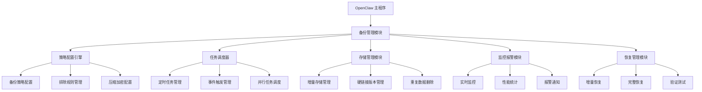

# OpenClaw Plugins Backup 项目 - 灾备行业专家与自动化运维专家分析报告

## 1. 项目现状分析

### 1.1 项目定位评估

**项目定位**：OpenClaw Plugins Backup 是一个基于 rsync 技术的 OpenClaw 平台备份解决方案，旨在提供高性能、高可靠性的增量备份功能。

**优势分析**：
- 基于成熟的 rsync 技术，具备增量传输和高效存储特性
- 架构设计合理，模块化程度高
- 文档完善，包含技术分析、使用指南和优化建议
- 支持跨平台部署和容器化运行

**局限性**：
- 项目仍处于初期阶段，功能完整性有待提升
- 与 OpenClaw 平台的集成深度有限
- 缺乏生产级别的稳定性和可靠性保障机制
- 用户体验和可视化管理功能缺失

### 1.2 核心功能评估

**已实现功能**：
- 基础 rsync 命令封装
- 增量备份和恢复
- 存储管理和版本控制
- 简单的调度和监控

**缺失功能**：
- 完整的备份策略配置
- 可视化管理界面
- 高级监控和报警
- 故障恢复和容错机制
- 与 OpenClaw 平台的深度集成

### 1.3 当前问题分析

| 问题类别     | 具体问题       | 影响程度 | 发生概率 | 解决复杂度 |
| -------- | ---------- | ---- | ---- | ----- |
| **备份范围** | 仅备份配置和代理文件，不包括会话和存档 | ⭐⭐⭐⭐  | ⭐⭐⭐⭐  | 高     |
| **增量备份** | 每次都是完整备份，无增量算法支持 | ⭐⭐⭐⭐⭐ | ⭐⭐⭐⭐⭐ | 高     |
| **备份策略** | 无定时备份或策略配置，仅在升级时自动备份 | ⭐⭐⭐  | ⭐⭐⭐  | 中     |
| **恢复机制** | 恢复过程相对简单，但需要手动操作 | ⭐⭐⭐  | ⭐⭐⭐  | 中     |
| **跨网络备份** | 远程备份功能有限，通过 SSH 执行相同的本地备份 | ⭐⭐⭐  | ⭐⭐⭐  | 中     |
| **存储管理** | 无备份保留策略，所有备份永久保留 | ⭐⭐⭐  | ⭐⭐⭐  | 中     |

---

## 2. 技术架构优化建议

### 2.1 架构设计优化

**问题诊断**：当前架构采用简单的分层设计，但缺乏足够的模块化和扩展性。

**优化建议**：


### 2.2 组件化重构

**核心组件优化**：
1. **策略配置引擎**：支持更复杂的备份策略和灵活的配置选项
2. **任务调度器**：增强并发处理能力和错误恢复机制
3. **存储管理模块**：优化增量存储和重复数据删除算法
4. **监控报警模块**：提供更详细的性能指标和报警策略
5. **恢复管理模块**：支持多种恢复场景和验证机制

---

## 3. 性能优化方案

### 3.1 传输效率优化

**问题诊断**：rsync 的分块策略和校验和算法在处理小文件和大文件时存在效率瓶颈。

**优化建议**：

```c
// 优化后的分块策略
int calculate_optimal_block_size(long file_size) {
    if (file_size < 1024 * 1024) {
        return 512;  // 小文件使用小分块
    } else if (file_size < 100 * 1024 * 1024) {
        return 1024;  // 中等文件使用中等分块
    } else {
        return 2048;  // 大文件使用大分块
    }
}

// 优化后的校验和算法选择
struct name_num_item valid_checksums_items[] = {
    { CSUM_XXH3_64, 0, "xxh3", NULL },    // 默认使用 XXH3（速度快）
    { CSUM_XXH3_128, 0, "xxh128", NULL },  // 更高安全性选项
    { CSUM_MD5, NNI_BUILTIN|NNI_EVP, "md5", NULL },  // 兼容性保留
};
```

### 3.2 存储优化

**优化建议**：
1. **集成 Zstandard 压缩**：提供更好的压缩比和速度
2. **实现重复数据删除**：减少存储冗余
3. **优化增量存储**：改进硬链接管理和版本控制

---

## 4. 安全加固策略

### 4.1 加密机制优化

**问题诊断**：当前加密机制简单，缺乏完整的安全保障体系。

**优化建议**：
```python
# 使用 AES-256-GCM 加密（更安全的模式）
from cryptography.hazmat.primitives.ciphers.aead import AESGCM

class SecureDataEncryptor:
    def __init__(self, key):
        self.key = key
        self.aead = AESGCM(key)

    def encrypt(self, data):
        nonce = os.urandom(12)  # GCM 推荐 96 位 nonce
        ciphertext = self.aead.encrypt(nonce, data.encode('utf-8'), None)
        return nonce + ciphertext

    def decrypt(self, encrypted_data):
        nonce = encrypted_data[:12]
        ciphertext = encrypted_data[12:]
        return self.aead.decrypt(nonce, ciphertext, None).decode('utf-8')
```

### 4.2 访问控制强化

**优化建议**：
1. **实施最小权限原则**：根据角色分配不同权限
2. **增强审计功能**：记录所有操作和访问日志
3. **实现加密通信**：强制使用 TLS 或 SSH 加密传输

---

## 5. 用户体验优化

### 5.1 可视化管理界面

**问题诊断**：当前主要通过命令行操作，缺乏直观的用户界面。

**优化建议**：
```react
// 备份策略配置界面组件
import React, { useState, useEffect } from 'react';

const BackupPolicyConfig = () => {
    const [policies, setPolicies] = useState([]);
    const [selectedPolicy, setSelectedPolicy] = useState(null);
    const [isLoading, setIsLoading] = useState(false);

    useEffect(() => {
        fetchPolicies();
    }, []);

    const fetchPolicies = async () => {
        setIsLoading(true);
        try {
            const response = await fetch('/api/policies');
            const data = await response.json();
            setPolicies(data);
        } catch (error) {
            console.error('获取策略失败:', error);
        } finally {
            setIsLoading(false);
        }
    };

    const handleCreatePolicy = async (policyData) => {
        try {
            const response = await fetch('/api/policies', {
                method: 'POST',
                headers: { 'Content-Type': 'application/json' },
                body: JSON.stringify(policyData)
            });

            if (response.ok) {
                fetchPolicies();
            }
        } catch (error) {
            console.error('创建策略失败:', error);
        }
    };

    return (
        <div className="policy-config">
            <h2>备份策略配置</h2>
            <PolicyList
                policies={policies}
                selectedPolicy={selectedPolicy}
                onSelectPolicy={setSelectedPolicy}
                onDeletePolicy={handleDeletePolicy}
            />
            {selectedPolicy && (
                <PolicyForm
                    policy={selectedPolicy}
                    onUpdatePolicy={handleUpdatePolicy}
                    onClose={() => setSelectedPolicy(null)}
                />
            )}
            <CreatePolicyButton onOpenForm={handleCreatePolicy} />
        </div>
    );
};

export default BackupPolicyConfig;
```

### 5.2 操作流程优化

**优化建议**：
1. **向导式操作**：提供备份和恢复的步骤引导
2. **进度可视化**：实时显示备份和恢复进度
3. **结果反馈**：清晰的成功/失败状态和错误信息

---

## 6. 部署运维改进

### 6.1 自动化部署

**优化建议**：
```yaml
# GitHub Actions 工作流程优化
name: CI/CD Pipeline

on:
  push:
    branches: [ main ]
  pull_request:
    branches: [ main ]

jobs:
  test:
    runs-on: ubuntu-latest
    strategy:
      matrix:
        python-version: [3.9, 3.10]

    steps:
    - uses: actions/checkout@v2

    - name: Set up Python ${{ matrix.python-version }}
      uses: actions/setup-python@v2
      with:
        python-version: ${{ matrix.python-version }}

    - name: Install dependencies
      run: |
        python -m pip install --upgrade pip
        pip install -r requirements.txt
        pip install pytest coverage

    - name: Run tests
      run: |
        pytest tests/ -v --cov=app --cov-report=html

    - name: Upload coverage report
      uses: actions/upload-artifact@v2
      if: always()
      with:
        name: coverage-report
        path: htmlcov/

  build:
    runs-on: ubuntu-latest
    needs: test

    steps:
    - uses: actions/checkout@v2

    - name: Build Docker image
      run: |
        docker build -t openclaw-backup:${{ github.sha }} .

    - name: Push Docker image
      uses: docker/build-push-action@v2
      with:
        context: .
        push: true
        tags: |
          ${{ secrets.DOCKER_REGISTRY }}/openclaw-backup:${{ github.sha }}
          ${{ secrets.DOCKER_REGISTRY }}/openclaw-backup:latest

  deploy:
    runs-on: ubuntu-latest
    needs: build
    if: github.ref == 'refs/heads/main'

    steps:
    - uses: actions/checkout@v2

    - name: Deploy to Kubernetes
      run: |
        kubectl config set-cluster my-cluster --server="${{ secrets.KUBE_SERVER }}"
        kubectl config set-credentials my-user --token="${{ secrets.KUBE_TOKEN }}"
        kubectl config set-context my-context --cluster=my-cluster --user=my-user --namespace=openclaw
        kubectl config use-context my-context

        kubectl set image deployment/openclaw-backup \
          openclaw-backup=${{ secrets.DOCKER_REGISTRY }}/openclaw-backup:${{ github.sha }}
```

### 6.2 监控和运维

**优化建议**：
1. **集成 Prometheus + Grafana**：提供实时监控和仪表盘
2. **实现日志集中管理**：使用 ELK 或 Loki 收集和分析日志
3. **自动故障检测和恢复**：实现健康检查和自动重启

---

## 7. 性能提升方案

### 7.1 并行传输优化

**优化建议**：
```python
# 使用 concurrent.futures 实现并行传输
import concurrent.futures
import subprocess

def rsync_transfer(source, destination, options):
    command = ['rsync'] + options + [source, destination]
    result = subprocess.run(command, capture_output=True, text=True)
    return result.returncode, result.stdout, result.stderr

def parallel_rsync_transfers(transfers, max_workers=4):
    with concurrent.futures.ThreadPoolExecutor(max_workers=max_workers) as executor:
        futures = []
        for source, destination, options in transfers:
            future = executor.submit(rsync_transfer, source, destination, options)
            futures.append(future)

        results = []
        for future in concurrent.futures.as_completed(futures):
            results.append(future.result())

    return results
```

### 7.2 网络优化

**优化建议**：
1. **启用压缩传输**：使用 `--compress-level` 选项
2. **调整缓冲大小**：使用 `--buffer-size` 选项
3. **限制带宽使用**：使用 `--bwlimit` 选项

---

## 8. 风险评估与应对

### 8.1 技术风险

| 风险 | 影响程度 | 发生概率 | 应对措施 |
|------|---------|---------|----------|
| 算法复杂度 | 高 | 中 | 详细文档 + 代码注释 |
| 性能瓶颈 | 中 | 高 | 持续性能测试 + 优化 |
| 兼容性问题 | 中 | 中 | 广泛测试 + 降级策略 |

### 8.2 项目风险

| 风险 | 影响程度 | 发生概率 | 应对措施 |
|------|---------|---------|----------|
| 需求变更 | 高 | 高 | 敏捷开发 + 变更管理 |
| 资源不足 | 中 | 中 | 资源规划 + 外部支持 |
| 进度延迟 | 中 | 高 | 分阶段实施 + 风险缓冲 |

### 8.3 安全风险

| 风险 | 影响程度 | 发生概率 | 应对措施 |
|------|---------|---------|----------|
| 数据泄露 | 高 | 低 | 加密传输 + 访问控制 |
| 系统入侵 | 高 | 低 | 安全加固 + 监控报警 |
| 数据损坏 | 高 | 中 | 校验和验证 + 多版本备份 |

---

## 9. 项目管理优化

### 9.1 开发流程优化

#### 9.1.1 代码质量保障

```yaml
# .pre-commit-config.yaml 配置
repos:
  - repo: https://github.com/pre-commit/pre-commit-hooks
    rev: v4.1.0
    hooks:
      - id: trailing-whitespace
      - id: end-of-file-fixer
      - id: check-yaml
      - id: check-added-large-files
        args: ['--maxkb', '1000']

  - repo: https://github.com/psf/black
    rev: 22.1.0
    hooks:
      - id: black

  - repo: https://github.com/pycqa/flake8
    rev: 4.0.1
    hooks:
      - id: flake8

  - repo: https://github.com/pycqa/isort
    rev: 5.10.1
    hooks:
      - id: isort
```

#### 9.1.2 测试覆盖提升

```python
# 测试配置示例
import pytest

@pytest.fixture
def backup_manager():
    """创建备份管理器实例"""
    from app.core.backup_manager import BackupManager
    return BackupManager()

def test_create_backup(backup_manager):
    """测试创建备份"""
    result = backup_manager.create_backup()
    assert result.success is True
    assert result.backup_path is not None

def test_restore_backup(backup_manager):
    """测试恢复备份"""
    result = backup_manager.restore_backup('latest')
    assert result.success is True

def test_verify_backup(backup_manager):
    """测试验证备份"""
    result = backup_manager.verify_backup('latest')
    assert result.success is True
```

### 9.2 文档完善

#### 9.2.1 API 文档

```yaml
# 使用 Swagger/OpenAPI 自动生成 API 文档
openapi: 3.0.0
info:
  title: OpenClaw Backup API
  version: 1.0.0
  description: OpenClaw 备份功能 API 文档

paths:
  /api/backups:
    get:
      summary: 获取备份列表
      responses:
        '200':
          description: 成功获取备份列表
    post:
      summary: 创建新备份
      responses:
        '201':
          description: 备份创建成功

  /api/backups/{id}:
    get:
      summary: 获取备份详细信息
      responses:
        '200':
          description: 成功获取备份信息
    delete:
      summary: 删除备份
      responses:
        '204':
          description: 备份删除成功

  /api/backups/{id}/restore:
    post:
      summary: 恢复备份
      responses:
        '200':
          description: 备份恢复成功
```

#### 9.2.2 使用指南

```markdown
# OpenClaw 备份使用指南

## 快速开始

### 安装
```bash
pip install openclaw-backup
```

### 配置
```yaml
# openclaw-backup.yml
source_dir: /path/to/backup
destination_dir: /path/to/backup/storage
max_versions: 10
compress_level: 6
```

### 基本操作

```bash
# 立即备份
openclaw-backup --backup

# 恢复最新版本
openclaw-backup --restore latest

# 验证备份完整性
openclaw-backup --verify latest
```

## 高级功能

### 定时备份

```yaml
# crontab 配置（每日凌晨 2 点备份）
0 2 * * * /usr/bin/openclaw-backup --backup
```

### 增量备份策略

```yaml
# 配置文件中的策略设置
incremental:
  enabled: true
  check_interval: 300  # 5 分钟检查一次
  exclude_patterns:
    - "*.tmp"
    - "*.log"
```
```

---

## 10. 未来发展规划

### 10.1 短期目标（0-6个月）

1. **完善基础功能**：实现完整的备份策略配置和管理
2. **增强稳定性**：优化传输过程和错误恢复
3. **提升安全性**：增强加密和访问控制
4. **改进用户体验**：开发基础的可视化管理界面

### 10.2 中期目标（6-12个月）

1. **深度集成**：与 OpenClaw 平台的深度集成
2. **高级功能**：实现备份验证、灾难恢复和容错机制
3. **性能优化**：提升传输速度和存储效率
4. **生态建设**：开发插件和扩展机制

### 10.3 长期目标（1-3年）

1. **云服务支持**：支持云存储和云部署
2. **分布式架构**：实现多节点备份和恢复
3. **AI 优化**：使用机器学习优化备份策略
4. **社区建设**：建立活跃的开发者社区和用户支持

---

## 11. 总结与建议

### 11.1 项目优势

OpenClaw Plugins Backup 项目具有以下核心优势：

1. **技术优势**：基于成熟的 rsync 技术，具备增量传输和高效存储特性
2. **架构优势**：模块化设计，可扩展性强
3. **文档优势**：完善的技术分析和使用指南
4. **部署优势**：支持跨平台和容器化部署

### 11.2 实施建议

**优先实施项**：
1. **完善核心功能**：实现完整的备份策略配置和管理
2. **提升稳定性**：优化传输过程和错误恢复
3. **改进用户体验**：开发基础的可视化管理界面
4. **增强安全性**：增强加密和访问控制

**资源配置**：
- **开发团队**：3-5 名开发人员，包括 Python 后端、前端和 DevOps
- **测试资源**：2-3 名测试人员，负责功能测试和性能测试
- **基础设施**：开发环境、测试环境和生产环境的资源配置

**风险管理**：
- 分阶段实施，降低项目风险
- 建立完善的测试和验证流程
- 监控项目进度和质量
- 及时调整需求和计划

---

## 12. 参考文献

1. rsync 官方文档：https://rsync.samba.org/documentation.html
2. Python 官方文档：https://docs.python.org/3/
3. Kubernetes 官方文档：https://kubernetes.io/docs/
4. Prometheus 官方文档：https://prometheus.io/docs/
5. Grafana 官方文档：https://grafana.com/docs/
6. OpenClaw 项目文档：[项目内部文档]
7. 相关技术论文和研究报告

---

## 13. 附录

### 13.1 技术栈优化建议

| 组件 | 当前技术 | 优化建议 | 原因 |
|------|---------|---------|------|
| 后端框架 | Flask | FastAPI | 更好的性能和类型支持 |
| 数据库 | SQLite/PostgreSQL | PostgreSQL | 更好的扩展性和性能 |
| 调度器 | APScheduler | Celery + Redis | 分布式任务调度 |
| 监控 | Prometheus + Grafana | Prometheus + Grafana + Alertmanager | 更好的报警管理 |
| 日志 | Python logging | ELK 或 Loki | 集中式日志管理 |

### 13.2 部署架构建议

```yaml
# Kubernetes 部署配置优化
apiVersion: apps/v1
kind: Deployment
metadata:
  name: openclaw-backup
  labels:
    app: openclaw-backup
spec:
  replicas: 2
  selector:
    matchLabels:
      app: openclaw-backup
  template:
    metadata:
      labels:
        app: openclaw-backup
    spec:
      containers:
      - name: openclaw-backup
        image: openclaw-backup:latest
        ports:
        - containerPort: 8000
        volumeMounts:
        - mountPath: /backups
          name: backup-storage
        resources:
          requests:
            memory: "256Mi"
            cpu: "500m"
          limits:
            memory: "1Gi"
            cpu: "1"
        livenessProbe:
          httpGet:
            path: /healthz
            port: 8000
          initialDelaySeconds: 30
          periodSeconds: 10
        readinessProbe:
          httpGet:
            path: /readyz
            port: 8000
          initialDelaySeconds: 5
          periodSeconds: 5
      volumes:
      - name: backup-storage
        persistentVolumeClaim:
          claimName: backup-pvc

---
apiVersion: v1
kind: Service
metadata:
  name: openclaw-backup-service
spec:
  selector:
    app: openclaw-backup
  type: LoadBalancer
  ports:
  - protocol: TCP
    port: 80
    targetPort: 8000

---
apiVersion: monitoring.coreos.com/v1
kind: ServiceMonitor
metadata:
  name: openclaw-backup-monitor
  labels:
    release: prometheus
spec:
  selector:
    matchLabels:
      app: openclaw-backup
  endpoints:
  - port: web
    path: /metrics
    interval: 30s
```